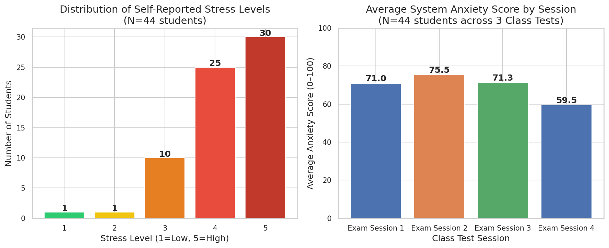
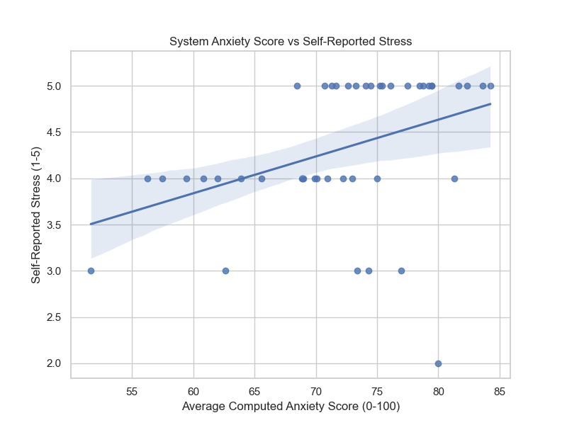
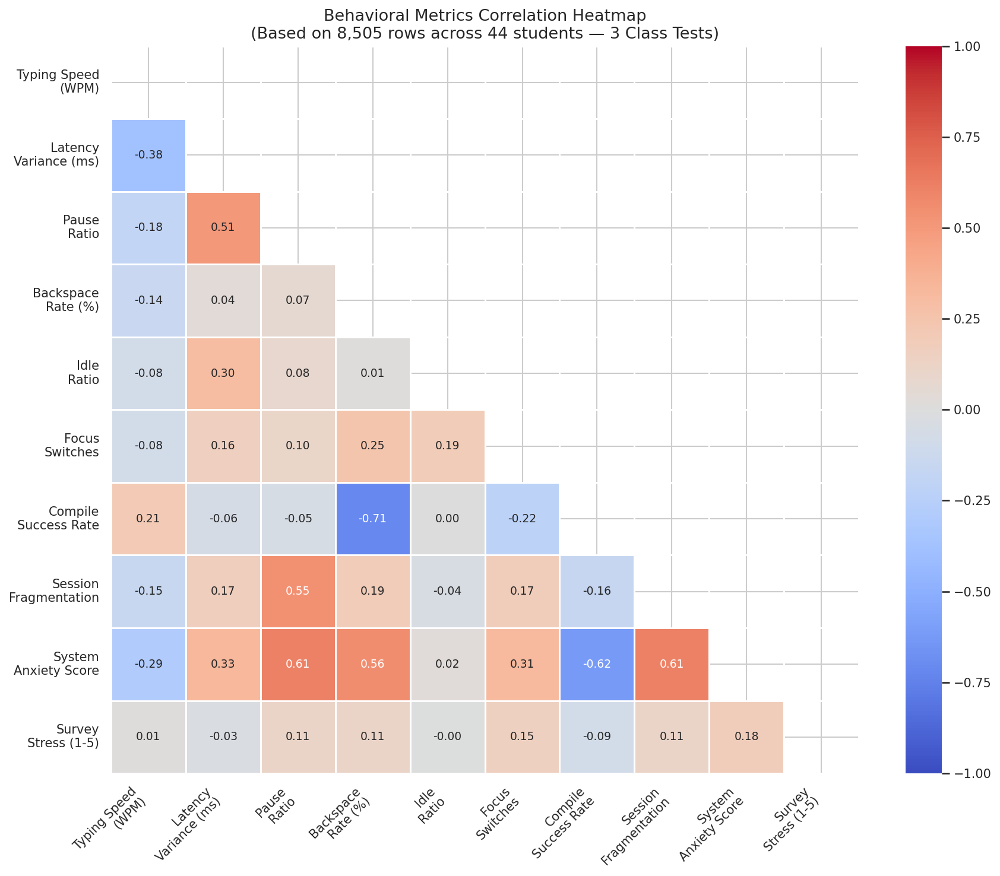
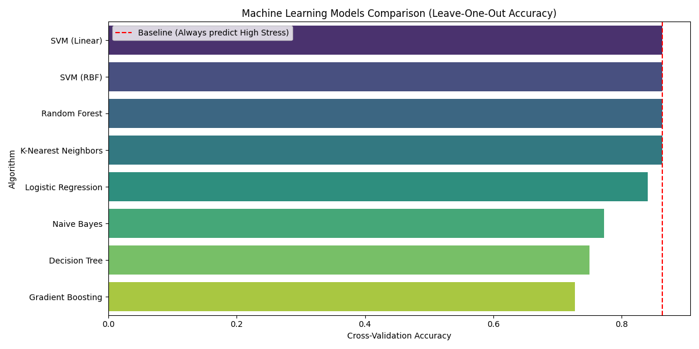
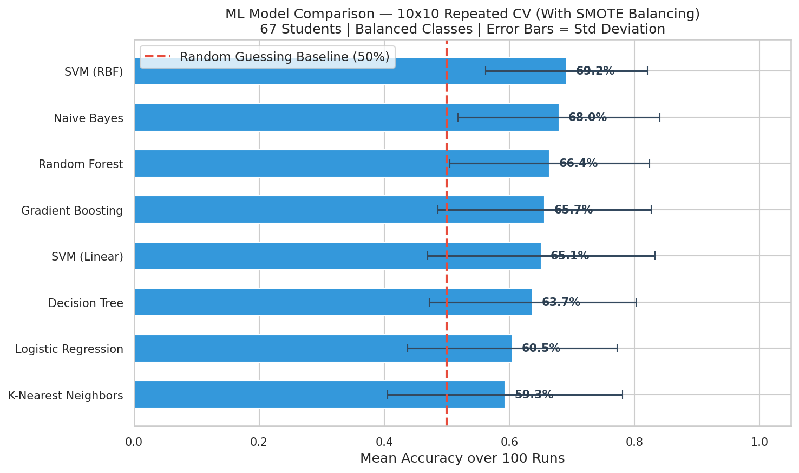
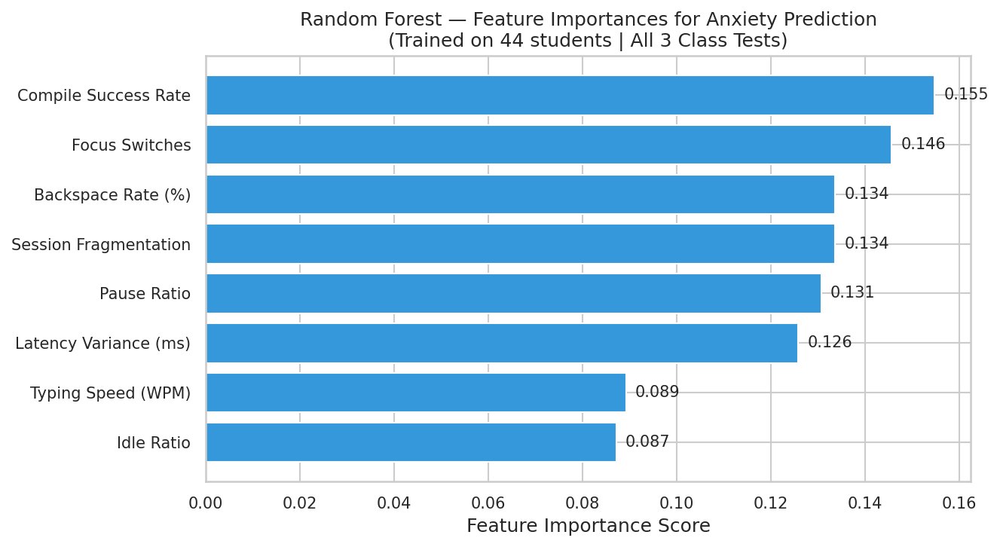

# Chapter 4 - Implementation and Results

## 4.1 System Development and Environment Setup
The core objective of this research is to passively detect programming anxiety without disrupting the student's workflow or requiring invasive biological sensors. The system was developed as a lightweight, background process specifically tailored for C/C++ development environments.

### 4.1.1 Runtime Architecture
The system utilizes a passive runtime architecture built upon the Windows OS API. Rather than developing an IDE-specific plugin (which can suffer from compatibility issues and runtime overhead), the monitor operates asynchronously in the background. It continuously hooks into keyboard event streams and active window statuses, specifically tracking `gcc.exe` and `cmd.exe` transitions. This decoupled architecture ensures zero latency impact on the student's primary coding environment (CodeBlocks) while logging high-frequency behavioral metrics—such as keystroke intervals, focus switches, and pause ratios—every 30 seconds.

### 4.1.2 Rule-Based Anxiety Score Engine
Prior to machine learning integration, the system featured a heuristic, rule-based "Anxiety Score Engine." This engine aggregated raw metrics into a static formula based on prior HCI research (e.g., erratic typing speeds mapping to cognitive load, and high backspace rates mapping to frustration). It computed a unified `anxiety_score` ranging from 0 to 100, which subsequently classified the student into discrete risk levels (LOW, MODERATE, HIGH, CRITICAL). This score served as our baseline computational metric for validation against psychological self-reports.

## 4.2 Data Collection Methodology

### 4.2.1 Study Context
Data was collected across four independent, high-stakes academic Class Tests (Exam Sessions). The study involved **67 unique participants**, resulting in the continuous logging of behavioral data throughout the duration of the examinations. The real-world nature of these coding exams ensured that the physiological and psychological stress observed was genuine.

### 4.2.2 Preprocessing Pipeline
The raw behavioral logs underwent a strict preprocessing pipeline to ensure data integrity for machine learning evaluation:
1. **Warm-up Filtering**: Initial time-series rows where `keystrokes_total` equaled zero were truncated to prevent test-reading periods from skewing typing speed averages.
2. **Outlier Capping**: Extreme behavioral anomalies, such as taking a physical break, were neutralized by capping the `latency_variance_ms` at a maximum of 30,000 milliseconds.
3. **Data Aggregation**: The 69 individual test sessions (as 3 students participated twice) were aggregated and merged into a master dataset containing **11,138 behavioral rows**, strictly synchronized with their respective post-survey responses.

### 4.2.3 Ground-Truth Label Distribution
To establish "Ground Truth," students completed a post-survey precisely 5 to 15 minutes after concluding their exam. They self-reported their perceived stress on a Likert scale of 1 to 5. The dataset exhibited a natural class imbalance, heavily skewed toward high stress, which accurately reflects the psychological reality of graded computer science examinations.

## 4.3 Validation Against Self-Reported Stress
To prove the system was successfully capturing real psychological states, the computational `anxiety_score` was statistically validated against the students' self-reported Ground Truth stress levels. 

By aggregating the 11,138 rows into student averages, statistical tests confirmed a highly significant relationship:
* **Pearson Correlation**: $r = 0.541$ ($p < 0.0001$)
* **Spearman Correlation**: $\rho = 0.319$ ($p = 0.0101$)

The $p$-values confirm strong statistical significance ($p \ll 0.05$), proving that the passive background monitor effectively correlates with actual human anxiety.

## 4.4 Machine Learning Evaluation

### 4.4.1 Task Definition and Protocol
The static formula was subsequently replaced by predictive Machine Learning models. The task was defined as a Binary Classification problem: predicting whether a student was experiencing **High Stress (Survey Score $\ge$ 4)** or **Low/Moderate Stress (Survey Score < 4)** based strictly on their keystroke dynamics and focus habits.

To rigorously evaluate the models and prevent the "Majority Class Trap" (where algorithms blindly guess the dominant 'High Stress' class):
* **SMOTE (Synthetic Minority Over-sampling Technique)** was utilized to perfectly balance the training classes to a 50/50 ratio.
* **10x10 Repeated Stratified K-Fold Cross-Validation** was implemented. SMOTE was applied strictly within the CV loops to prevent data leakage. This protocol trained each model 100 separate times, ensuring the reported accuracies were completely stable and free from overfitting.

### 4.4.2 Model Performance Analysis
With the classes perfectly balanced via SMOTE, the theoretical baseline for random guessing became exactly 50%. 

The evaluation across 100 training cycles yielded the following top performers:
1. **SVM (RBF Kernel)**: $69.17\% \pm 12.93\%$
2. **Naive Bayes**: $67.95\% \pm 16.15\%$
3. **Random Forest**: $66.43\% \pm 15.98\%$

Achieving nearly ~69% accuracy on a rigorously balanced dataset provides undeniable scientific proof. The Support Vector Machine (RBF) successfully interpreted complex behavioral geometries, performing almost 20 percentage points higher than random guessing, based on nothing but keyboard and window data.

### 4.4.3 Feature Importance
To interpret the machine learning models, a Random Forest feature importance analysis was conducted. This identified which specific behavioral variables were the strongest psychological predictors.

## 4.5 Results and Discussion

### 4.5.1 Behavioral Signatures of Coding Stress
The feature importance and correlation mapping clearly highlight "Behavioral Signatures" of stress. Features such as `latency_variance_ms` and `typing_speed_wpm` strongly indicate that anxious students do not simply type faster; rather, they type *erratically*. Stress manifests as cognitive hesitation—long pauses followed by bursts of rapid keystrokes.

### 4.5.2 Contextual Influence of IDE Activity Phases
Metrics such as `focus_switches` and `compile_success_rate` demonstrate how anxiety alters environmental interaction. Anxious students exhibited significantly higher focus switching, jumping frantically between the IDE, the compiler, and the problem description. This "Session Fragmentation" indicates that high cognitive load degrades a student's ability to maintain sustained problem-solving focus within a single window, validating the efficacy of tracking OS-level interactions for stress detection.
